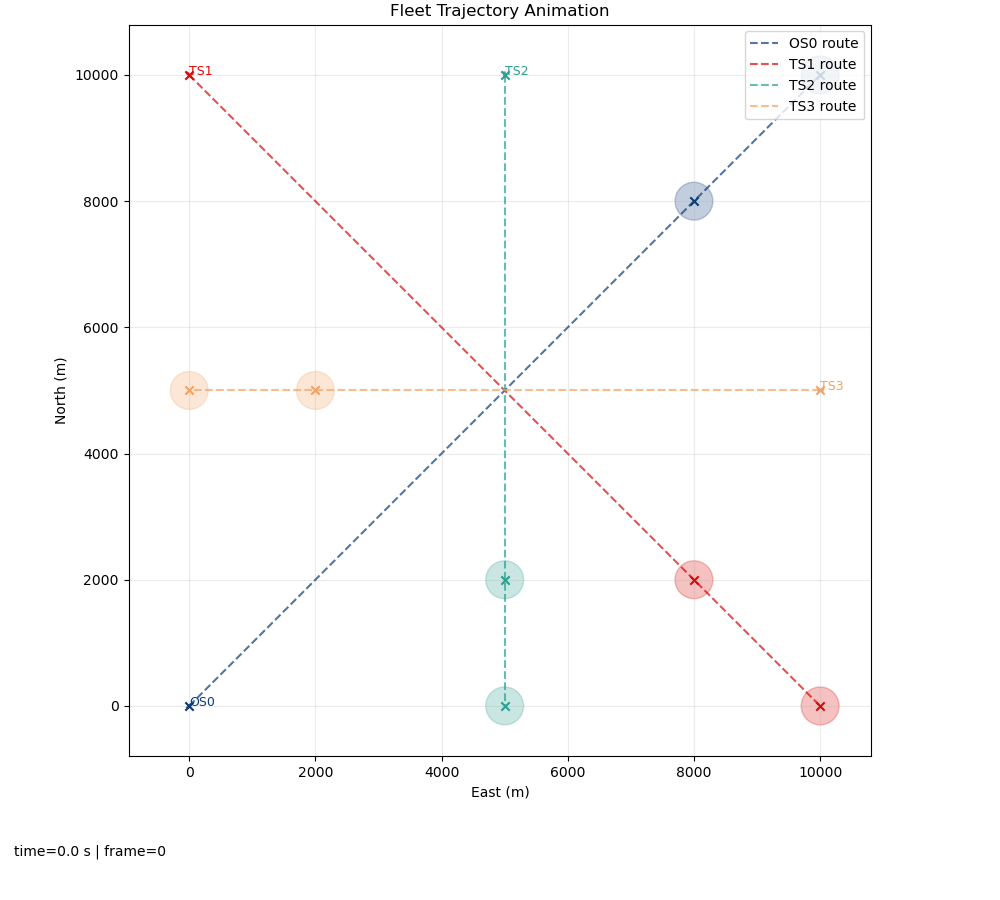
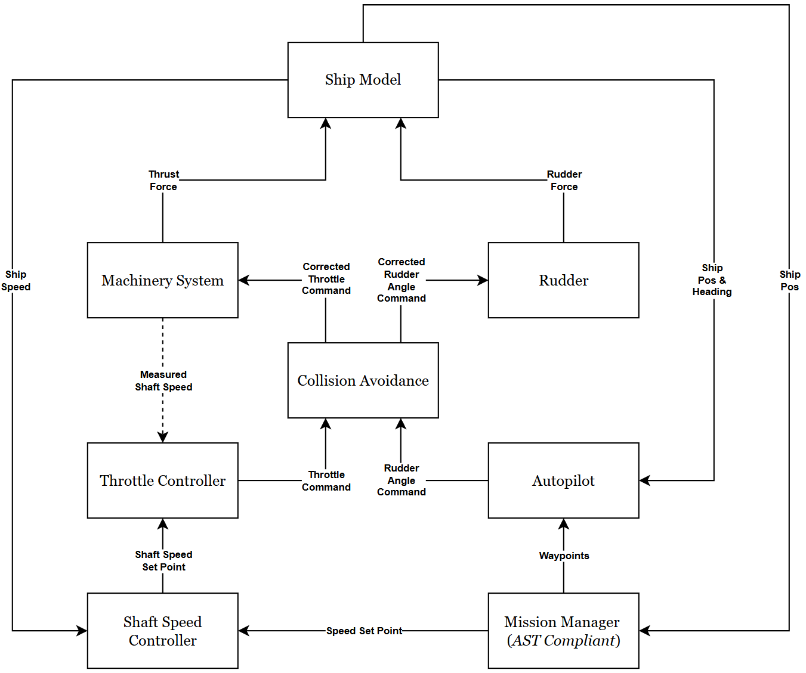

# Ship in Transit Co-simulation
Repository for Ship in Transit simulator in Co-simulation form.


## Conda Environment Setup [Simulator Only]

First clone the repository. Make sure conda is installed. Then, set up the conda environment by running this command in terminal:

```bash
conda env create -f sit_cosim.yml
```

### Libcosimpy
When using co-simulation as a simulator base, we require the use of `libcosimpy` in order to orchestrate the FMUs when doing simulation. Install the Python library by running:
```bash
pip install libcosimpy
```

### FFmpeg
This simulator supports animation visualization. However it requires `FFmpeg` module to **save** the animation as a file with video extension.
Install `FFmpeg` in conda:
```bash
conda install conda-forge::ffmpeg
```


## Dependencies for Adaptive Stress Testing (Optional)

Only when you care about doing reinforcement learning-based process. Recommended to do these steps in order.

### Gymnasium
First, we need to install `gymnasium` to define the RL observation and action space, and wraps our custom RL-environment wrapper to comply with `stable-baselines3` package. Install this package by running:
```bash
pip install gymnasium
```

### Stable-Baselines 3
We also use `stable-baselines3`, which is a `pytorch`-compliant version for RL algorithms implementation. This package will be used as the core for our AST algorithm. Install this package by running:
```bash
pip install 'stable-baselines3[extra]'
```
To view the training process, `stable-baselines3` uses `tensorboard` using the `events.out.tfevents.*` file stored inside `<log_path>\tb`, commonly `trained_model\AST-train*\tb`. If not installed, we first need to install `tensorboard` by running:
```bash
pip install tensorboard
```
To view the charts, in the terminal first run:
```bash
tensorboard --logdir "<log_path>/tb"
```
While the terminal is running, go to the Tensorboard URL shown in the terminal. Commonly printed as: `http://localhost:6006/`. 
> **You can ignore the `TensorFlow installation not found` warning messages! Because we are using `PyTorch`**

### PyTorch
 We use `pytorch` to build the multi-layer perceptron network related with Reinforcement Learning (RL) implementaion for the AST. The onboard `pytorch` inside `stable-baselines3` only supports `cpu`-device. We need to reinstall it with the other `pytorch` version with `cuda` support to enable `cuda` acceleration for the training process. Please consult with [PyTorch official website](https://pytorch.org/get-started/locally/) for local installation guide. 
 
 Generally we need to uninstall the onboard `pytorch` from the previous `stable-baselines3` installation by running:
```bash
pip3 uninstall torch torchvision
```
 
 This model is developed on Windows OS, using CUDA 12.6-compliant NVIDA GPU. Install this package by running:
```bash
pip3 install torch torchvision --index-url https://download.pytorch.org/whl/cu126
```

---

##  Ship in Transit Co-simulation

The **ship-in-transit co-simulation** is a modular Python-based co-simulation framework for modeling and running transit scenarios of a marine vessel. It includes ship dynamics, machinery system behaviors, navigation logic, and environmental effects each in a form of a Functional Mockup Unit (`FMU`).

Think of `FMU` as a seperate sub-simulator describing a sub-system that can be simulated independently. Using `libcosimpy`, we can orchestrate all of these `FMUs` in harmony into a single complex system simulated as one entity. Below are shown how all FMUs is connected and orchestrated together:



This simulator is developed based on Ship in Transit Simulator created by Børge Rokseth (**borge.rokseth@ntnu.no**). Original simulator can be found [here](https://github.com/BorgeRokseth/ship_in_transit_simulator.git).


### Ship Dynamics

The ship model simulates motion in **three degrees of freedom**:

- **Surge**
- **Sway**
- **Yaw**

#### State Variables

The full system state includes:

- `x_N`: North position [m]
- `y_E`: East position [m]
- `ψ`: Yaw angle [rad]
- `u`: Surge velocity [m/s]
- `v`: Sway velocity [m/s]
- `r`: Yaw rate (turn rate) [rad/s]

> ⚠️ **ANGLE IN NED FRAME**
>
> When we first initiate the ship heading, `0°` starts from `NORTH (y+)` direction. **Positive heading** is clockwise in direction.


**Additional states** (depending on machinery system model):

- `ω_prop`: Propeller shaft angular velocity [rad/s] — for detailed machinery system
- `T`: Thrust force [N] — for simplified model

#### Forces Modeled

- Inertial forces  
- Added mass effects  
- Coriolis forces  
- Linear and nonlinear damping  
- Environmental forces (wind and current)  
- Control forces (propeller & rudder)

### Machinery System

The ship includes:
- **1 propeller shaft**
- **1 rudder**
- Powered by either a **main diesel engine** or a **hybrid shaft generator**.

#### Energy Sources

- **Main Engine (ME)**: Primary mechanical power source  
- **Hybrid Shaft Generator (HSG)**: Can operate as motor/generator  
- **Electrical Distribution**: Powered by diesel generators

#### Machinery Modes

| Mode   | Propulsion Power       | Hotel Load Power        |
|--------|------------------------|-------------------------|
| PTO    | Main Engine            | Hybrid SG (generator)   |
| MEC    | Main Engine            | Electrical Distribution |
| PTI    | Hybrid SG (motor)      | Electrical Distribution |

#### Available Machinery Models

1. **Detailed Model** — includes propeller shaft dynamics  
2. **Simplified Model** — thrust modeled as a 2nd order transfer function  

### Navigation System

Two navigation modes:

- **Heading-by-Reference**: Maintains a specified heading.  
- **Waypoint Controller**: Follows a sequence of waypoints using Line of Sight (LOS) guidance.

### Environmental Forces

- **Wind** : Gust component based from NORSOK Spectrum. Stochasticity is drawn from Ornstein-Uhlenbeck process.  
- **Current** : Stochasticity is drawn from Ornstein-Uhlenbeck process.  

### Speed Control Options

1. **Throttle Input**: A direct command representing propulsion load percentage  
2. **Shaft Speed Controller**: Regulates propeller shaft speed to maintain desired vessel speed  

###  Example Scenarios

- Single-engine configuration using only the Main Engine in PTO mode  
- Complex hybrid-electric propulsion control  

---

## Importing Route and Map from Open Street Map

The repository provides utilities for importing and visualizing **real-world maps** from [OpenStreetMap (OSM)](https://www.openstreetmap.org/). These are primarily used to define simulation areas and plan ship routes within realistic maritime environments.

### Overview

The **map import system** is designed to integrate OSM-based geographic data with the ship simulator.  
Using this, users can:
- Load real coastal or harbor maps as simulation backdrops.  
- Define navigable areas and obstacles based on OSM geometry.  
- Combine OSM-derived maps with manually added obstacles for detailed scenario definition.

### Workflow

1. **Prepare the Map File**
   - The repository provides tools to extract OSM data and save it as a `.gpkg` (GeoPackage) file.  
   - Each layer in the `.gpkg` file (e.g., “frame”, “obstacles”, “routes”) corresponds to different spatial elements used by the simulator.

2. **Load Map in the Simulator**
   - Use helper functions from `utils.prepare_map` such as:
     ```python
     from utils.prepare_map import get_gdf_from_gpkg
     frame_gdf, ocean_gdf, land_gdf, coast_gdf, water_gdf = get_gdf_from_gpkg(GPKG_PATH, FRAME_LAYER, OCEAN_LAYER, LAND_LAYER, COAST_LAYER, WATER_LAYER)
     ```
   - The map geometry is read using `geopandas` and can be directly visualized or used in the environment setup.

3. **Define and Visualize Routes**
   - Route files (typically in `.txt`) define the waypoints of the ship’s mission.  
   - These can be plotted together with the map using:
     ```python
     from utils.get_path import get_map_path, get_ship_route_path
     ```
   - Visualization scripts are provided in `test_beds/map_and_route_plotter/plot_realmap_route.py`.

4. **Typical Use Case**
   - Extract the harbor region from OSM.  
   - Generate a `.gpkg` file containing relevant boundaries and water areas.  
   - Load the map into the simulator and overlay route waypoints to verify the navigation corridor.

5. **File Structure Example**
   ```
   data/
   ├── map/
   │   └── basemap.gpkg
   │   └── ...
   └── route/
       └── own_ship_route.txt
       └── ...
   ```

6. **Supported Layers**
   The imported `.gpkg` may include:
   - **Frame**: Simulation area boundary  
   - **Water**: Navigable regions  
   - **Obstacle**: Islands, piers, or restricted areas  
   - **Route**: Reference paths for the ship

<!-- ### Example Script

To visualize both the map and the route:
```bash
python test_beds/map_and_route_plotter/plot_realmap_route.py
```

This script loads the `.gpkg` map and overlays all route files found in `data/route`.  
The result is a clear view of how your simulation environment aligns with real-world geography. -->

---

## Setting up the Ship in Transit Co-Simulation
TBA
<!-- For usage and integration examples, refer to the provided scripts in `test_beds`.

Generally, building this simulator is done by doing these steps:
1. Prepare configuration objects to build one ship asset:
   - Ship configurations built from `ShipConfiguration()`
   - Machinery configurations (including machinery modes) built from `MachinerySystemConfiguration()`
   - Simulator configuration built from `SimulationConfiguration()`
2. Using these configuration objects, build the ship using `ShipModel()`.
3. The ship model needs throttle and heading controllers to carry out an autonomous mission.  
   - A simple engine throttle controller with fixed desired speed can be set up using `EngineThrottleFromSpeedSetPoint()`.  
   - A heading controller using LOS Guidance can be set up using `HeadingByRouteController()`. For this, mission waypoints should be provided in a file named `_ship_route.txt`.
4. To allow a ship to “choose” new intermediate waypoints during simulation, use `HeadingBySampledRouteController()`.  
   This builds on the LOS controller but only requires two initial waypoints (start and end) in `_ship_route.txt`.
5. Multiple ship models can run simultaneously. For this, use `ShipAssets()` — a collection of `ShipModel()` objects and associated parameters. Typically:
   - The **first** ship asset represents the **own** ship (under test)
   - The **remaining** ships act as **target** or **obstacle** ships
6. These assets are passed to the RL environment for adaptive stress testing. -->